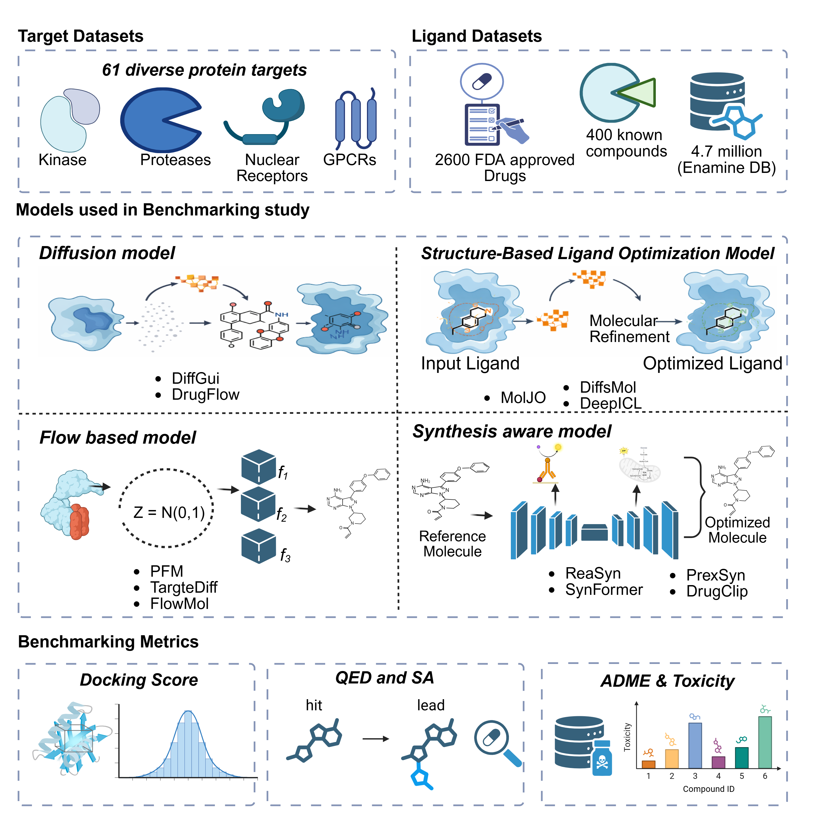

# DrugDesignAI-Benchmark

## **Benchmarking AI-based molecular generation models for structure-based drug discovery**

This repository provides reproducible pipelines for benchmarking AI-driven molecular design models for structure-based drug discovery.

Drug discovery increasingly relies on artificial intelligence–driven generative models to explore chemical space and design novel therapeutically relevant molecules. However, systematic comparisons of these models across diverse biological targets and realistic drug-like chemical spaces remain limited. This repository provides a reproducible benchmarking framework for evaluating modern AI-based molecular generation approaches in structure-based drug discovery.

Our benchmark includes **61 diverse protein targets** spanning major druggable protein families, including kinases, proteases, nuclear receptors, and GPCRs. To ensure realistic evaluation conditions, we compiled a reference chemical space consisting of **~2600 FDA-approved drugs**, **~400 experimentally validated bioactive compounds**, and **4.7 million screening compounds from the Enamine database**. These molecules serve as anchors for assessing chemical validity, drug-likeness, and structural optimization performance.

The benchmarking framework evaluates multiple classes of generative and optimization models, including **diffusion-based models (DiffGui, DrugFlow)**, **flow-based models (PFM, TargetDiff, FlowMol)**, **structure-based ligand optimization models (MolJO, DiffSMol, DeepICL)**, and **synthesis-aware models (ReaSyn, SynFormer, PrexSyn, DrugCLIP)**. Generated molecules are systematically assessed using a unified evaluation pipeline that integrates **docking score analysis, drug-likeness metrics (QED and synthetic accessibility), and ADME/toxicity prediction**.

This repository contains the datasets, scripts, and workflows necessary to reproduce the benchmarking experiments and extend the framework to additional models and targets. By providing standardized datasets and evaluation pipelines, this resource aims to facilitate transparent comparison of AI-driven molecular design approaches and accelerate the development of next-generation drug discovery algorithms.

---

## Dataset

FDA approved drugs downloaded from ZINC database.

## Models Evaluated

- ReaSyn
- TargetDiff
- MolJO
- PFM
- DiffSMol
- FlowMol

## Example: Run ReaSyn

bash scripts/run_reasyn_gpu0.sh

## Benchmark Pipeline

1. Collect FDA drugs
2. Convert SMILES to model input
3. Generate molecules
4. Perform docking
5. Compare scores

## Hardware

NVIDIA A100 GPUs

## Citation

If you use this repository please cite our manuscript.